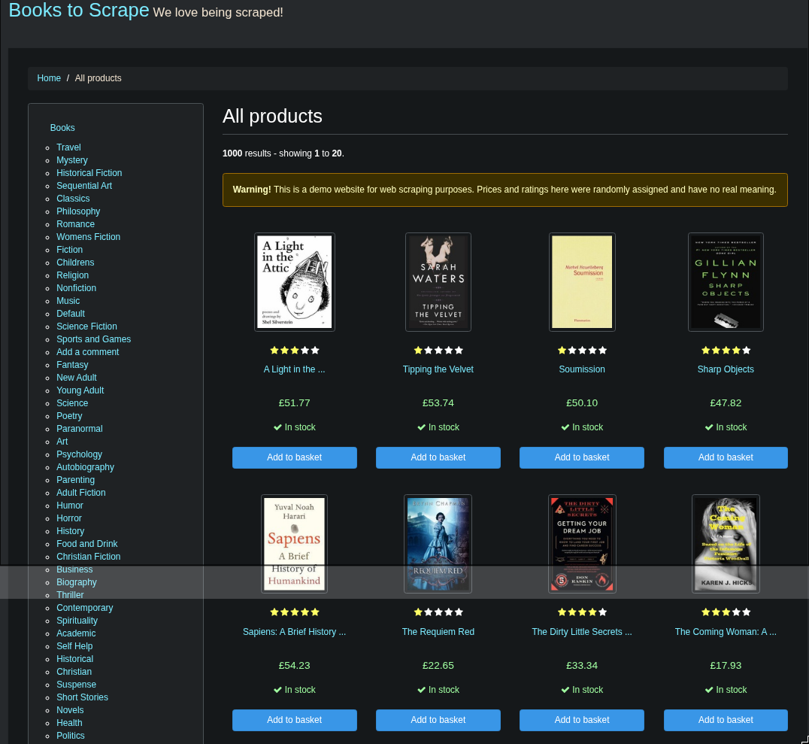
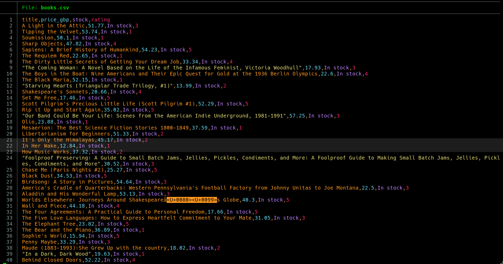

# Books Scraper

A simple Python web scraper that extracts book data from [books.toscrape.com](http://books.toscrape.com).

## Features

- Scrapes all 1,000 books across 50 pages.
- Extracts title, price (£), stock availability, and rating.
- Outputs a clean CSV file.
- Polite scraping: 1‑second delay between requests, proper error handling.
- Clean price extraction: strips currency symbols and odd characters using regular expressions.

## Screenshots

**books.toscrape.com homepage**

**Terminal output**

## How to Run

1. Clone this repo.
2. Create and activate a virtual environment.
3. Install dependencies: `pip install -r requirements.txt`
4. Run `python scraper.py`
5. The data is saved in `books.csv`.

## Technologies

- Python 3
- requests
- BeautifulSoup4

## Ethics

This project was built against a sandbox site specifically designed for scraping practice. All scraping is performed ethically, with delays and error handling. For any real website, I always check `robots.txt` and respect rate limits.

## Portfolio

I'm a physics graduate and Python developer. This is a foundational project in my data engineering portfolio. I can build custom scrapers for your business needs – contact me.

## Author

Diogo A. F. Melo – [GitHub](https://github.com/diogoafmelo)
